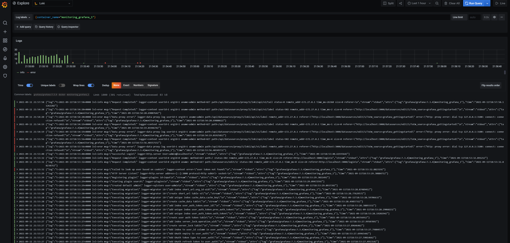
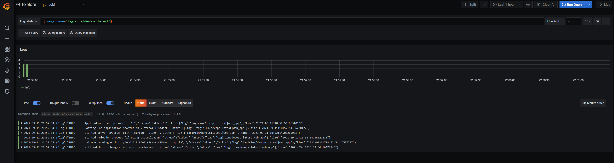
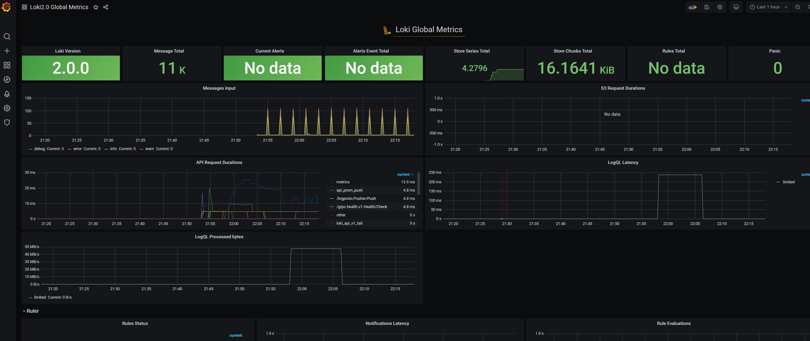
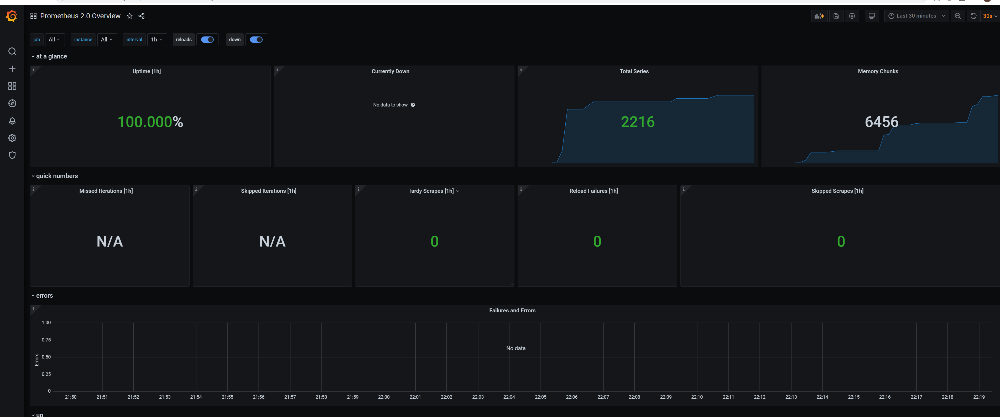
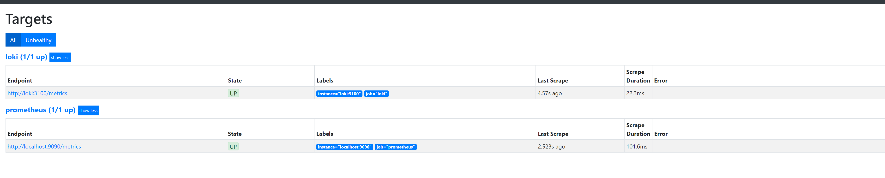

# Monitoring: logging

## What is used
Used `Promtail > Loki > Grafana` stack.

## Proof of work

Overall info from Grafana, we can look at container using its name

Or, by image name

## Best practices

### Loki

According to official documentation
* Static labels are good
* Use dynamic labels sparingly
* Label values must always be bounded
* Be aware of dynamic labels applied by clients
* Configure caching
* Logs must be in increasing time order per stream
* Use `chunk_target_size`
* Use `-print-config-stderr` or `-log-config-reverse-order`

### Grafana

* When creating a new dashboard, make sure it has a meaningful name.

* If you are creating a dashboard to play or experiment, then put the word TEST or TMP in the name.

* Consider including your name or initials in the dashboard name or as a tag so that people know who owns the dashboard.

* Remove temporary experiment dashboards when you are done with them.

* If you create many related dashboards, think about how to cross-reference them for easy navigation. Refer to Best practices for managing dashboards for more information.

* Grafana retrieves data from a data source. A basic understanding of data sources in general and your specific is important.

* Avoid unnecessary dashboard refreshing to reduce the load on the network or backend. For example, if your data changes every hour, then you don’t need to set the dashboard refresh rate to 30 seconds.

* Use the left and right Y-axes when displaying time series with different units or ranges.

* Add documentation to dashboards and panels.

* To add documentation to a dashboard, add a Text panel visualization to the dashboard. Record things like the purpose of the dashboard, useful resource links, and any instructions users might need to interact with the dashboard. Check out this Wikimedia example.

* To add documentation to a panel, edit the panel settings and add a description. Any text you add will appear if you hover your cursor over the small i in the top left corner of the panel.

* Reuse your dashboards and enforce consistency by using templates and variables.

* Be careful with stacking graph data. The visualizations can be misleading, and hide important data. We recommend turning it off in most cases.

* Avoid dashboard sprawl, meaning the uncontrolled growth of dashboards. Dashboard sprawl negatively affects time to find the right dashboard. Duplicating dashboards and changing “one thing” (worse: keeping original tags) is the easiest kind of sprawl.
* Periodically review the dashboards and remove unnecessary ones.
* If you create a temporary dashboard, perhaps to test something, prefix the name with TEST: . Delete the dashboard when you are finished.
* Copying dashboards with no significant changes is not a good idea.
* You miss out on updates to the original dashboard, such as documentation changes, bug fixes, or additions to metrics.
* In many cases copies are being made to simply customize the view by setting template parameters. This should instead be done by maintaining a link to the master dashboard and customizing the view with URL parameters.
* When you must copy a dashboard, clearly rename it and do not copy the dashboard tags. Tags are important metadata for dashboards that are used during search. Copying tags can result in false matches.
* Maintain a dashboard of dashboards or cross-reference dashboards. This can be done in several ways:
* Create dashboard links, panel, or data links. Links can go to other dashboards or to external systems. For more information, refer to Linking.
* Add a Dashboard list panel. You can then customize what you see by doing tag or folder searches.
* Add a Text panel and use markdown to customize the display.
#### Related to creating the dashboards
* A dashboard should tell a story or answer a question
* Dashboards should reduce cognitive load, not add to it
* When creating a new dashboard, make sure it has a meaningful name.
* If you create many related dashboards, think about how to cross-reference them for easy navigation.
* Avoid unnecessary dashboard refreshing to reduce the load on the network or backend.
* Use the left and right Y-axes when displaying time series with different units or ranges.
* Add documentation to dashboards and panels.
* Reuse your dashboards and enforce consistency by using templates and variables.
* Be careful with stacking graph data.
* The visualizations can be misleading, and hide important data. Recommended turning it off in most cases.

## Metrics

### Working dashboards

### Services' logs

